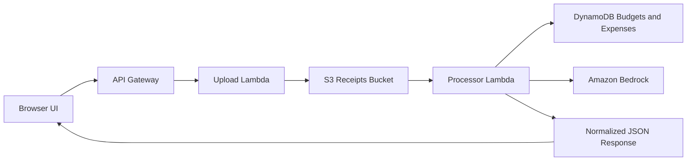

# BudgetSnap

BudgetSnap is a small serverless demo that turns receipt uploads into budget-aware expense entries.

It uses a static frontend plus AWS Lambda, Amazon S3, Amazon DynamoDB, Amazon API Gateway, and Amazon Bedrock. The public repo is sanitized for reuse, so it does not include credentials, account-specific ARNs, screenshots, or generated deployment artifacts.

## AWS Services Used

1. Amazon S3
Stores uploaded receipt files before processing and also hosts the static frontend for the web app.

2. AWS Lambda
Runs the serverless backend logic. One Lambda handles browser uploads and another processes receipts, reads budget data, and writes expense records.

3. Amazon API Gateway
Exposes the HTTP upload endpoint used by the frontend so the browser can send receipt files to the backend without managing infrastructure directly.

4. Amazon DynamoDB
Stores budget limits and processed expense entries. It is used by the processor Lambda to compare each new receipt against the current category budget.

5. Amazon Bedrock
Provides the AI extraction path for reading receipt content, identifying key fields, and assigning a category. The project also supports a fallback mode when model access is throttled.

6. Amazon CloudWatch Logs
Captures logs from the Lambda functions and serves as the main debugging and observability layer for monitoring upload and processing failures.

## Features

- Upload receipt images or PDFs from a browser
- Extract merchant, date, subtotal, tax, total, and category
- Store processed expenses in DynamoDB
- Compare each expense against a category budget
- Return a simple budget status and spending advice
- Run with Amazon Bedrock or a mock fallback mode

## Architecture

1. The frontend uploads a receipt to an HTTP API.
2. The upload Lambda stores the file in S3.
3. The processor Lambda reads the uploaded object.
4. The processor extracts receipt data with Bedrock or a deterministic fallback.
5. The processor checks category budgets in DynamoDB.
6. The API returns a normalized JSON response to the frontend.



## Quick Start

Prerequisites:

- AWS CLI authenticated against your AWS account
- PowerShell 5.1 or newer
- Permission to create Lambda, S3, DynamoDB, IAM, and API Gateway resources

Run the deployment script:

```powershell
.\deploy\deploy.ps1
```

The script will:

- create or reuse the main DynamoDB tables
- create S3 buckets for uploads and static hosting
- create or update the Lambda functions
- create an HTTP API for uploads
- configure the frontend with the deployed API URL
- upload the static site to S3
- print the live app URL and API URL

## Deployment Options

The deploy script accepts a few useful parameters:

```powershell
.\deploy\deploy.ps1 -ProjectName budgetsnap -Region us-east-1
.\deploy\deploy.ps1 -ProjectName budgetsnap -DefaultUserId demo-user
.\deploy\deploy.ps1 -UseRealBedrock
```

Parameters:

- `ProjectName`: resource prefix, defaults to `budgetsnap`
- `Region`: AWS region, defaults to `us-east-1`
- `DefaultUserId`: seed/demo user id, defaults to `demo-user`
- `UseRealBedrock`: enables live Bedrock calls instead of mock fallback mode

## Frontend Configuration

The frontend reads its API endpoint from an inline config object in [index.html](index.html):

```html
window.BUDGETSNAP_CONFIG = {
  apiUrl: ""
};
```

The deployment script populates this automatically for the hosted copy. If `apiUrl` is empty, the UI stays in demo mode.

## Local Testing

You can test the Bedrock extraction flow locally with:

```powershell
python bedrock_quickstart.py --file sample-receipts/receipt_transport_02.png --mock-on-throttle
```

## Repository Layout

- [index.html](index.html): single-page frontend
- [lambda/lambda_function.py](lambda/lambda_function.py): receipt processor Lambda
- [lambda/api_upload_handler.py](lambda/api_upload_handler.py): upload Lambda
- [deploy/website-config.json](deploy/website-config.json): S3 website config template
- [dynamodb-seed](dynamodb-seed): sample data and seed helpers
- [sample-receipts](sample-receipts): test receipts for demos

## Reuse Notes

This repository is intended to be reusable:

- replace placeholders in template policy files if you deploy manually
- do not commit AWS credentials or account-specific secrets
- generated screenshots, videos, build outputs, and zip packages are ignored
